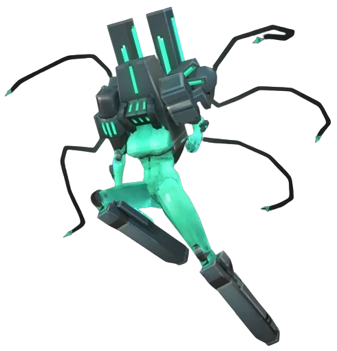

# Mindflayer

## Tipo
Enemigo élite

## Estrategia
Mantén distancia y castígalo con Railcannon.

## Apariencia 
Los **Mindflayers** son máquinas humanoides flotantes con cuerpos femeninos de color verde azulado y cabezas robóticas. La máquina en sí está integrada en la cabeza y la parte superior del cuerpo, con una “cabeza” de forma rectangular, dos segmentos a modo de hombros y un par de protuberancias rectangulares que sobresalen de su espalda. Las líneas a lo largo del metal brillan con una luz verde azulado, y cinco cables con forma de tentáculo se extienden desde distintos puntos, terminando en aguijones luminosos que dejan tras de sí estelas de luz verde azulado.
